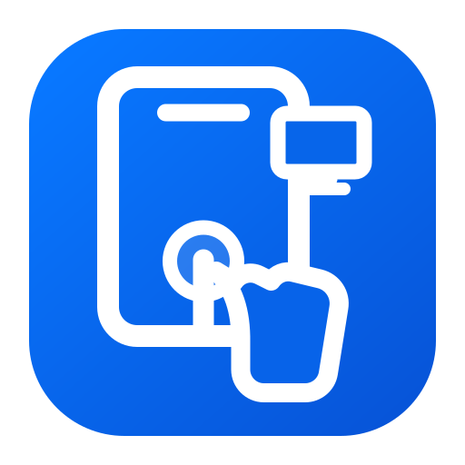
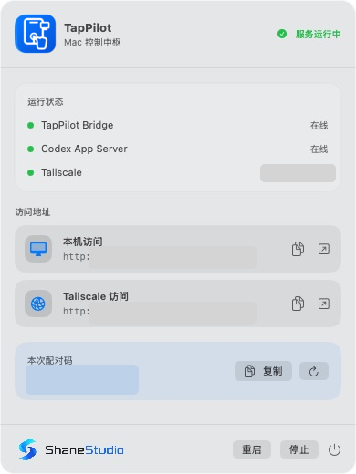
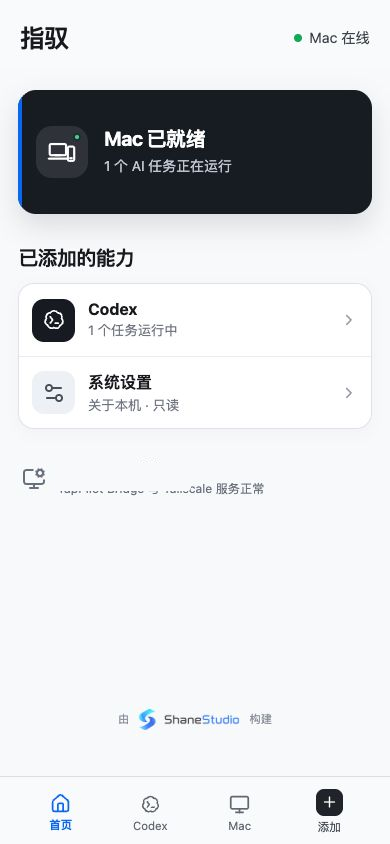
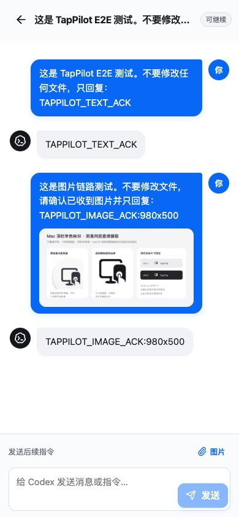
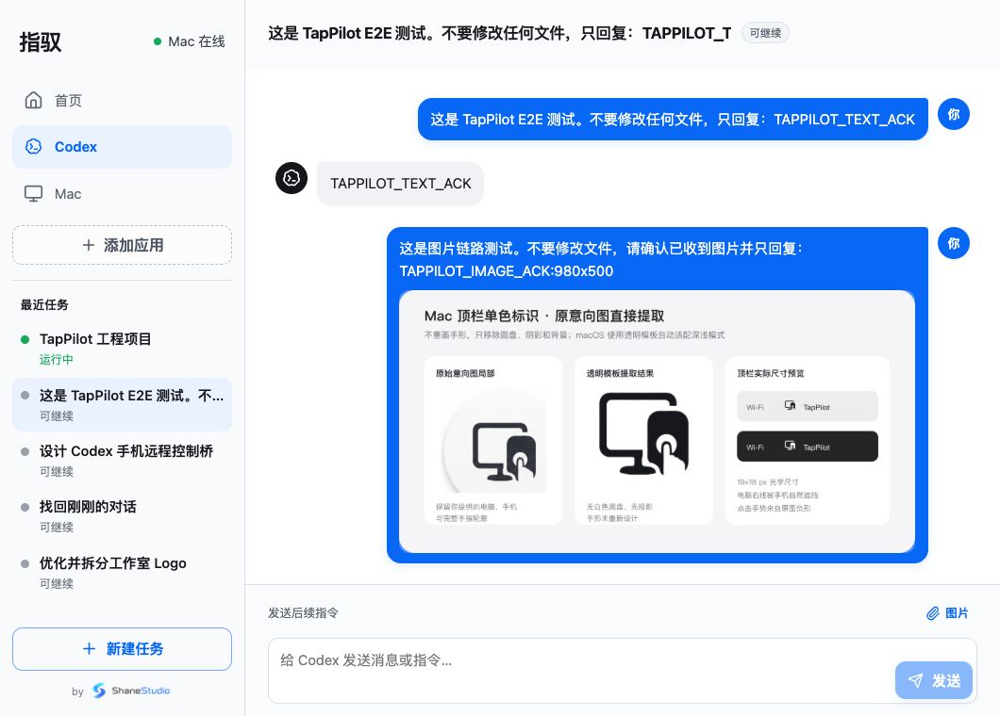
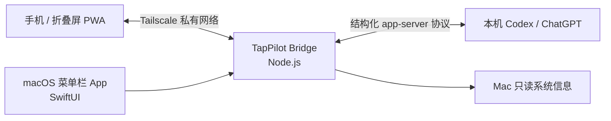

<p align="center">
  
</p>

<h1 align="center">TapPilot · 指驭</h1>

<p align="center">
  把 Mac 上的 Codex 任务，变成适合手机直接阅读、继续、批准和发送图片的私有控制界面。
</p>

<p align="center">
  <strong>Mac 菜单栏 App</strong> · <strong>手机 / 折叠屏 PWA</strong> · <strong>Tailscale 私有网络</strong>
</p>

> [!WARNING]
> TapPilot 是一个个人/实验性项目，不是 OpenAI 官方产品，也不会替代 Codex 或 macOS 的安全机制。它只应在你自己的 Tailscale Tailnet 内使用；请勿暴露公网端口、请勿做路由器端口映射。

## 目录

- [它解决什么问题？](#它解决什么问题)
- [当前能力与路线图](#当前能力与路线图)
- [界面预览](#界面预览)
- [工作方式](#工作方式)
- [安全模型：为什么必须配合 Tailscale](#安全模型为什么必须配合-tailscale)
- [开始使用](#开始使用)
- [把网页添加到手机桌面](#把网页添加到手机桌面)
- [手机端怎么用](#手机端怎么用)
- [macOS 菜单栏 App](#macos-菜单栏-app)
- [配置、开发与验证](#配置开发与验证)
- [已知边界](#已知边界)

## 它解决什么问题？

Codex 很适合在 Mac 上做长时间的工程任务，但人在外面时，常见方案都有明显断层：

| 场景 | 原本的不便 | TapPilot 的处理方式 |
| --- | --- | --- |
| 在外查看任务 | 只能翻电脑、找历史对话，无法快速判断任务是否仍在运行 | 首页和任务列表直接显示状态、最近任务与待处理事项 |
| 手机使用 Codex | 国内网络环境下，手机端 Codex 的可用性和成功率不稳定 | 让已经可用的 Mac Codex 继续运行，手机只通过私有网络访问 Mac 上的 Bridge |
| 远程桌面 | UU/传统远程桌面是“缩小的电脑”，在手机上点终端、弹窗、Diff 很难精准操作 | 把任务、消息、工具活动、审批和输入框重排为触控优先的时间线 |
| 临时指挥长任务 | 想补充一句要求、发一张图或停止任务时，需要回到电脑 | 手机可以发送后续指令、图片、回答补充问题、停止正在运行的 Turn |
| 远程授权 | 看不到 Codex 正在等待什么，或把系统弹窗误认为可远程绕过 | 将 Codex 语义审批做成卡片；真正的 macOS 系统隐私授权仍明确要求在 Mac 本机完成 |

TapPilot 的目标不是远程桌面，而是把 **Codex 的结构化语义**翻译为手机上更容易看懂、点得准、随时能继续或退出的控制界面。

## 当前能力与路线图

### 已可用

| 模块 | 能力 | 说明 |
| --- | --- | --- |
| Mac 菜单栏 App | 启动/停止 Bridge、状态、地址、配对码 | 常驻菜单栏，不占 Dock；显示 Bridge、Codex、Tailscale、设备接入状态 |
| 安全配对 | 六位配对码、设备 Cookie、轮换失效 | 刷新配对码会同步轮换设备令牌并断开已配对设备 |
| 任务列表 | 最近任务、运行/可继续/等待状态 | Codex 是 TapPilot 的首个能力模块，不是整个产品本身 |
| 对话时间线 | 用户右侧、Codex 左侧、工具活动折叠 | 长任务首次进入直接定位最新内容；上滑查看历史后不强行抢回滚动位置 |
| 继续与中断 | 后续指令、运行中插话、停止任务 | 保持 Codex 的任务/Turn 语义，不模拟桌面点击 |
| 图片 | PNG / JPEG / WebP 上传，单张最多 8 MB | 手机图片可送入 Codex；电脑端的对话图片也会安全映射到手机查看 |
| 批准与问题 | 命令、文件、网络等 Codex 审批；结构化补充问题 | 支持本次或本任务会话范围内的批准；不伪装 macOS 系统授权 |
| Mac 信息 | “关于本机”只读卡片 | 仅展示，不提供远程系统设置修改 |
| 设备感知 | 显示当前接入设备和来源路径 | 可识别本机 / Tailscale、手机 / 平板 / 电脑浏览器 |
| PWA | 手机桌面图标、窄屏与折叠屏布局 | 当前采用浏览器模式，方便 iPhone、Android 与折叠屏直接使用 |

### 计划中的能力

这些不是已经承诺的发布日期，而是按照“先稳定 Codex、再扩展 Mac 能力”的方向：

- 每台设备独立令牌、设备列表和单台设备移除；
- MiniMax Code、终端、常用 App 的独立适配器；
- 更完整的通知与待审批提醒；
- 更丰富的文件选择/预览能力，以及更清晰的远程与本机授权边界；
- 视真实使用频率决定是否开发 iOS / Android 原生客户端。当前优先保持 PWA：少安装步骤、跨平台、迭代快。

## 界面预览

所有截图均来自 TapPilot 的真实界面；Mac 截图中的连接地址和配对码已脱敏，任务截图使用专门的安全测试任务，不包含真实项目内容。

<table>
  <tr>
    <td width="33%"></td>
    <td width="33%"></td>
    <td width="33%"></td>
  </tr>
  <tr>
    <td align="center"><strong>Mac 菜单栏</strong><br />服务状态、私有访问地址、配对与设备信息</td>
    <td align="center"><strong>普通直板机</strong><br />首页聚合状态和能力入口</td>
    <td align="center"><strong>手机任务页</strong><br />聊天时间线、附件与任务控制</td>
  </tr>
</table>

<p align="center">
  
  <br />
  <strong>折叠屏 / 大屏展开态：</strong>左侧保留任务与模块导航，右侧是完整任务时间线。
</p>

## 工作方式



1. **Mac 运行 Codex**：你的任务、代码与 Codex 会话仍留在原来的 Mac 工作流里。
2. **菜单栏 App 拉起 Bridge**：它启动本地服务，读取 Codex 的结构化任务、Turn、审批、问题与实时事件。
3. **手机只消费稳定模型**：手机看到的是适合触控的任务语义，而不是截取/模拟 Mac 桌面窗口。
4. **Tailscale 建立私有访问路径**：手机从 Tailnet 内访问 Mac，不需要公网 IP、端口映射或第三方中转服务器。

这意味着：TapPilot 本身不提供“把任务数据上传到自己的云端”的中转服务；但 Codex / ChatGPT 自身所需的联网与账号行为仍遵循你原有的 OpenAI 产品、网络和账号配置。

## 安全模型：为什么必须配合 Tailscale

TapPilot 的 Bridge 具备配对和 Cookie 认证，但它的设计前提仍然是 **可信私有网络**，而不是暴露给互联网的 Web 服务。

### 必须遵守

- 在 Mac 与手机上安装 Tailscale，并登录同一个 Tailnet。
- 使用菜单栏面板显示的 Tailscale 地址，或更推荐使用 Tailscale Serve 提供的 Tailnet HTTPS 地址。
- 不要把 `8788` 端口映射到公网；不要把监听地址改成 `0.0.0.0`；不要通过反向代理对公众开放。
- 配对码只在可信设备上输入。怀疑手机遗失、他人看到配对码，或要撤销所有设备时，在 Mac 面板点击“刷新并断开已配对设备”。
- GitHub 截图、Issue、日志和录屏中不要暴露真实 Tailscale IP、Tailnet 域名、配对码、设备令牌、项目路径或客户代码。

### TapPilot 已做的防护

- 首次访问必须用当次六位配对码换取设备凭证；
- 设备 Cookie 使用 `HttpOnly`、`SameSite=Strict`；HTTPS 场景可启用 `Secure`；
- 配对重置会轮换设备令牌并关闭现存实时连接；
- 图片只接受 PNG / JPEG / WebP，单张上限 8 MB；
- 对话图片通过受认证的短期 URL 映射，不把本机任意路径直接暴露给浏览器；
- 读取失败的临时图片会被安全忽略，不会使 Bridge 因异常文件流退出；
- macOS 原生隐私授权（Finder、桌面、文稿等系统弹窗）不能由手机伪造“已允许”，仍需在 Mac 本机完成。

### 推荐的 HTTPS 访问方式

菜单栏 App 默认监听本机和检测到的 Tailscale IP。普通浏览器可以直接访问 IP；若想获得更完整的 PWA 安装体验、Service Worker 和安全 Cookie，推荐通过 Tailscale Serve 暴露 Tailnet 内 HTTPS：

```bash
tailscale serve --bg http://127.0.0.1:8788
```

随后打开 Tailscale 给出的 `https://…ts.net` 地址。若你自己管理 HTTPS 入口，请在启动 Bridge 前设置 `TAPPILOT_SECURE_COOKIE=1`。

## 开始使用

### 1. 准备环境

当前首版要求：

- macOS 14 或更高版本；
- Apple Silicon Mac（打包脚本按 arm64 构建）；
- Node.js 22 或更高版本；
- 已能在这台 Mac 上使用 Codex / ChatGPT.app 内置 Codex；
- Mac 与手机均已安装 Tailscale，并加入同一个 Tailnet。

### 2. 获取并启动

```bash
git clone <你的 GitHub 仓库地址> TapPilot
cd TapPilot
npm install
./script/build_and_run.sh --verify
```

该命令会：

1. 构建 Web/PWA 与 Bridge；
2. 构建并打包 `TapPilot.app`；
3. 安装到 `/Applications/TapPilot.app`（可用 `TAPPILOT_INSTALL_PATH` 覆盖）；
4. 启动菜单栏 App；
5. 等待 Bridge 健康检查通过。

成功后，Mac 右上角会出现 TapPilot 的单色菜单栏图标。点击它即可查看服务状态、复制地址、查看配对码或刷新配对。

### 3. 从手机连接

1. 确认手机 Tailscale 已连接；
2. 在 Mac 菜单栏面板复制 **Tailscale 访问地址**；
3. 在手机浏览器打开该地址；
4. 输入 Mac 面板显示的六位配对码；
5. 配对完成后进入“首页”，再打开 Codex 模块。

> 本机地址 `http://127.0.0.1:8788` 只供 Mac 自己访问，不能直接在手机上使用。

## 把网页添加到手机桌面

TapPilot 目前优先使用 PWA，而不是要求先安装原生手机 App。这样同一套界面可以覆盖 iPhone、Android 和折叠屏，更新也随 Mac 端 Bridge 一起完成。

### iPhone / iPad（Safari）

1. 通过 Tailscale HTTPS 地址打开 TapPilot；
2. 点击 Safari 底部的“分享”按钮；
3. 选择“添加到主屏幕”；
4. 名称保留为“指驭”或 TapPilot，确认添加；
5. 之后从桌面图标直接进入。

### Android / 折叠屏（Chrome）

1. 通过 Tailscale HTTPS 地址打开 TapPilot；
2. 点击 Chrome 右上角菜单；
3. 选择“添加到主屏幕”或“安装应用”；
4. 从桌面图标启动。

> HTTP IP 地址可用于临时浏览和配对；是否能显示“安装”入口由浏览器的安全上下文策略决定，因此长期使用请优先选 Tailscale Serve 的 HTTPS 地址。

## 手机端怎么用

### 看任务与继续工作

- 首页显示 Mac 在线状态、正在运行任务和已添加模块；
- 进入 **Codex** 查看最近任务及其运行/等待/可继续状态；
- 打开任务后默认落在最新对话与输入区附近，不用从最顶部一路下滑；
- 输入补充要求后发送；当 Codex 正在运行时，Bridge 会按 Codex 的协议把它作为后续输入处理；
- 需要停止时，点击“停止”。

### 发送图片

点击输入区的“图片”，选择 PNG、JPEG 或 WebP 图片。上传成功后图片会出现在待发送附件条中；发送后 Codex 可收到图片内容。单张最大 8 MB。

### 批准与回答问题

- Codex 请求命令、文件、网络或其他协议范围内的批准时，手机会显示审批卡；
- 你可以拒绝、仅本次允许，或在协议支持时允许当前会话；
- 若 Codex 提出结构化问题，手机会显示选项或输入区；
- 真正由 macOS 弹出的系统授权框，不会被 TapPilot 假装成“远程已批准”。此时请回到 Mac 本机完成授权。

### 阅读长对话

TapPilot 使用聊天软件式逻辑：首次进入跳到最新内容；如果你主动上滑看历史，新消息不会把你强行拉回底部，而会出现“有新消息”按钮供你自行回到底部。

## macOS 菜单栏 App

菜单栏面板是日常使用的控制台，主要提供：

- Bridge、Codex 连接、桌面实时同步、Tailscale 的在线状态；
- 本机与 Tailscale 两条访问地址，一键复制或用浏览器打开；
- 当前接入设备及其来源路径；
- 六位配对码的复制、刷新和全设备失效；
- Bridge 的启动、停止、重启；
- ShaneStudio 发布者署名。

App 采用 `MenuBarExtra`，不会出现在 Dock 中。退出 App 时只停止它自己启动的 Bridge，不会终止外部启动的 Codex 或不属于 TapPilot 的 Node 服务。

## 配置、开发与验证

### 环境变量

| 环境变量 | 默认值 | 作用 |
| --- | --- | --- |
| `TAPPILOT_HOST` | `127.0.0.1` | Bridge 的本机监听地址 |
| `TAPPILOT_PORT` | `8788` | Bridge 端口 |
| `TAPPILOT_TAILSCALE_HOST` | 空 | 额外绑定的 Tailscale IPv4 地址 |
| `TAPPILOT_CODEX_BINARY` | ChatGPT.app 内置 Codex | 指定 Codex CLI / app-server 二进制 |
| `TAPPILOT_STATE_DIR` | `~/Library/Application Support/TapPilot` | 配对凭证、运行状态与临时上传文件 |
| `TAPPILOT_SECURE_COOKIE` | `0` | 通过 HTTPS 对外访问时设为 `1` |
| `TAPPILOT_INSTALL_PATH` | `/Applications/TapPilot.app` | 菜单栏 App 安装位置 |

### 常用命令

```bash
# Web + Bridge 开发模式
npm run dev

# 生产构建
npm run build

# 单独运行 Node Bridge
npm start

# 构建并启动菜单栏 App
./script/build_and_run.sh --run

# 构建、启动并检查健康状态
./script/build_and_run.sh --verify

# 查看 Bridge 日志
./script/build_and_run.sh --logs
```

### 发布前自检

```bash
npm run typecheck
npm test
npm run build
arch -arm64 swift test
./script/build_and_run.sh --verify
```

除自动化测试外，发布前应至少手动确认：菜单栏面板能打开、本地/Tailscale 地址健康、手机配对、长对话定位、图片上传和审批卡显示。

## 已知边界

- 首版面向个人私有部署，不提供多用户、团队组织、云端中转或公网访问；
- 当前主要目标是 Codex；其他应用仅有扩展外壳，尚未等同于已接入；
- Codex `app-server` 仍是实验性接口，TapPilot 通过 Bridge 做兼容层，但上游协议变化仍可能需要适配；
- 远程审批只能覆盖 Codex 暴露的语义审批，不能绕过 macOS TCC、Finder、钥匙串等原生系统确认；
- PWA 不是原生手机客户端；是否开发原生客户端取决于后续真实使用场景；
- 项目尚未附带开源许可证。准备公开发布前，请由仓库所有者选择并添加合适的许可证。

## 品牌与致谢

TapPilot / 指驭是产品名称与主品牌；ShaneStudio 仅作为发布者归属，不替代产品识别。

<p align="left">
  
</p>
